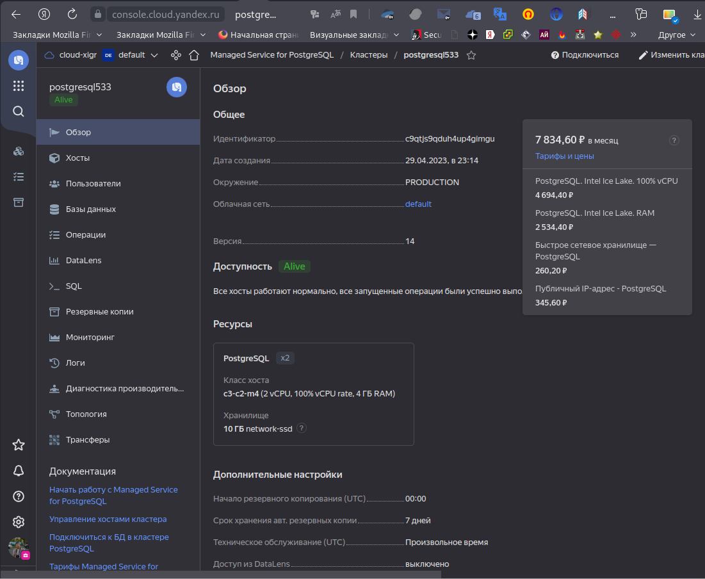
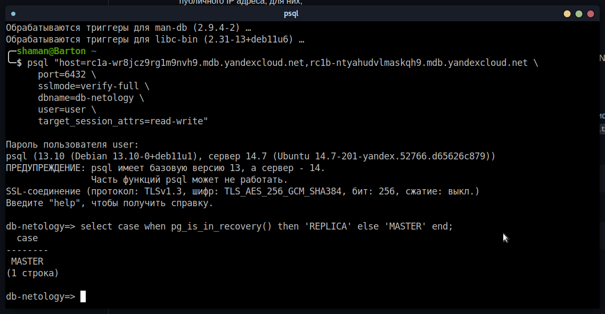
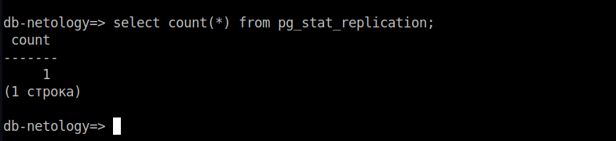
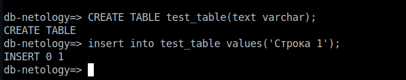
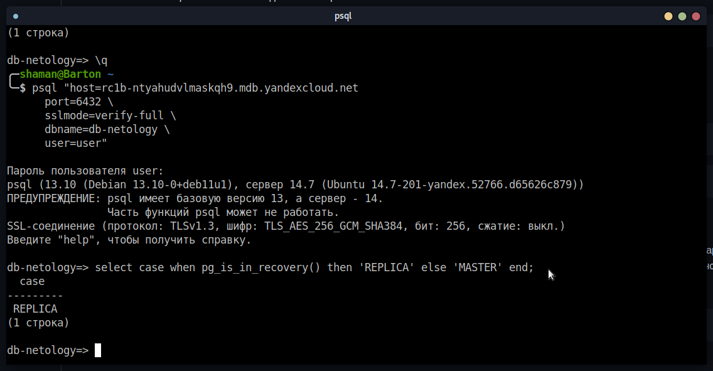
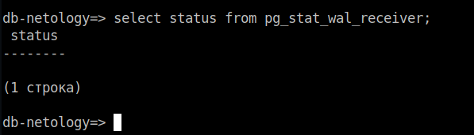
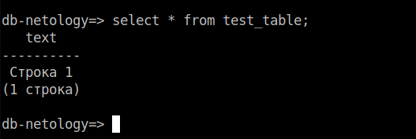

# Домашнее задание к занятию `12.09 «Базы данных в облаке»` - `Живарев Игорь`

### Задание 1

`Создание кластера`

`Подключение к мастеру и реплике`

`Количество подключенных реплик`

`Создание таблицы и добавление строки`

`Подключитесь к узлу-реплике`

`Проверка состояния репликации`

`Проверки репликации данных между зонами доступности облака`

---
